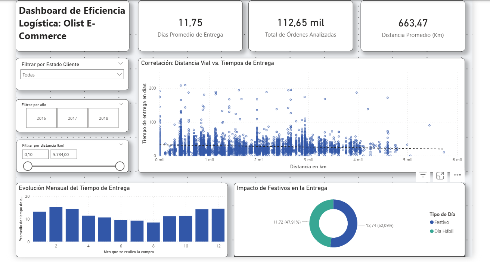

# Optimización Logística en E-Commerce: Análisis de Olist

[](https://www.python.org/)
[](https://powerbi.microsoft.com/)
[]()

> **Nota:** Este proyecto es parte del portafolio profesional para la postulación al cargo de *Data Analyst* en **Datalized**. Se basa en una adaptación ejecutiva de mi Memoria de Título de Ingeniería Civil Industrial (UTFSM).

## 1. Contexto y Problema de Negocio

En el ecosistema del comercio electrónico brasileño, la logística es el principal factor de fricción debido a la complejidad geográfica del país.

El dataset público de **[Brazilian E-Commerce by Olist](https://www.kaggle.com/datasets/olistbr/brazilian-ecommerce)** ofrece una visión transaccional de 100k órdenes, pero carece de variables logísticas profundas.

**La Pregunta Analítica:**

> *¿Qué factores operativos y geográficos están generando las mayores brechas (Gaps) entre la promesa de venta y la entrega real, impactando la satisfacción del cliente?*

Este proyecto no se limita a visualizar los datos entregados, sino que enriquece el modelo con **datos externos de infraestructura vial y calendarios festivos** para contrastar la teoría (distancia lineal) con la realidad operativa.

## 2. Arquitectura de la Solución

El flujo de trabajo sigue un pipeline de datos estructurado para garantizar la reproducibilidad y la calidad del dato ("Golden Record").

```
Raw Data Olist + Datos Propios
         ↓
ETL & Cleaning (Python/Pandas)
         ↓
Feature Engineering
         ↓
Dataset Maestro
    ↙        ↘
Power BI    Modelos ML
 Dashboard
```

### Tecnologías Utilizadas

- **Procesamiento:** Python (Pandas, NumPy)
- **Análisis Exploratorio:** Jupyter Notebooks, Seaborn, Matplotlib
- **Visualización:** Microsoft Power BI
- **Control de Versiones:** Git / GitHub

## 3. Metodología de Procesamiento (ETL)

El procesamiento detallado se encuentra disponible en el siguiente notebook:

👉 [**Ver Código Fuente (ETL & Feature Engineering)**](notebooks/01_ETL_y_Feature_Engineering.ipynb)

### A. Ingesta y Enriquecimiento

Se integraron las 8 tablas relacionales de Olist con dos fuentes de datos propietarias:

- **Matriz de Distancias Viales:** Datos reales de rutas por carretera entre estados (construida manualmente desde [distanciaentreascidades.com.br](https://www.distanciaentreascidades.com.br)), superando la limitación de la distancia Haversine (lineal).
- **Calendario de Festivos:** Para calcular el impacto de días no hábiles en el Lead Time.

### B. Reglas de Negocio y Limpieza

- **Integridad de la Variable Dependiente:** Se eliminaron registros sin fecha de entrega para evitar sesgos en el cálculo de tiempos.
- **Imputación Inteligente:**
  - *Reviews:* Se imputó "without comments" para no perder feedback cuantitativo.
  - *Dimensiones:* Se normalizaron productos sin dimensiones con valores mínimos técnicos para evitar errores de cálculo volumétrico.

### C. Definición de Variables del Modelo

Se estructuró el dataset final diferenciando claramente las variables para el modelo predictivo:

- **Variable Dependiente (\(Y\)):**
  - `order_delivery_time`: Tiempo real de entrega en días.

- **Variables Independientes (\(X\)):**
  - `distance_km`: Variable crítica de distancia real por carretera.
  - `product_volume_cm3`: Cálculo cúbico para análisis de estiba.
  - `is_holiday`: Variable binaria (1/0) para aislar el efecto estacional.

## 4. Visualización y Hallazgos (Power BI)

El dashboard interactivo ha sido diseñado para diagnosticar los cuellos de botella logísticos. A continuación se presenta una vista previa de la solución:



*Captura del Dashboard Final: Monitor de KPIs Logísticos y Análisis de Dispersión*

### Composición del Dashboard

El panel responde a la pregunta de negocio a través de 3 dimensiones visuales:

1. **Monitor de KPIs:** Tarjetas superiores que resumen el Tiempo Promedio de Entrega, Volumen de Órdenes y Distancia Media recorrida.

2. **Análisis de Dispersión (Causa Raíz):** Gráfico central (*Scatter Plot*) que cruza `Distancia Vial` vs `Tiempo de Entrega`. Permite identificar que, si bien la distancia influye, existen ineficiencias operativas graves en distancias cortas (puntos verticales a la izquierda).

3. **Dinámica Temporal y Estacional:** Gráficos inferiores que evalúan la evolución mensual de los tiempos y el impacto de los días festivos en el cumplimiento de la promesa.

### Insights Clave (Respuesta a la Pregunta)

El análisis visual confirma que:

- **Geografía:** Los estados del Norte y Nordeste presentan los mayores tiempos de espera, correlacionados directamente con la distancia vial extrema.
- **Operación vs. Distancia:** El gráfico de dispersión revela una alta variabilidad en distancias cortas (<500km), indicando que una parte significativa de la fricción **no es el transporte, sino el procesamiento en bodega (Seller Processing Time).**
- **Estacionalidad:** Se observan picos de demora en meses clave (Black Friday / Navidad), sugiriendo saturación logística más allá de la distancia física.

👉 [Ver Dashboard Interactivo en Power BI](https://app.powerbi.com/view?r=eyJrIjoiZTY0NmFhNzYtZWRiYy00YTk1LTlkYzQtYWMwNmJjZTU1ZGFhIiwidCI6ImJlMzI2OWE1LWEzOTAtNGE5MC05MWUwLWM5ZjQ5NTEyYWI5OSJ9)

*(Nota: El dashboard es público y no requiere credenciales de acceso)*

> **⚠️ Nota sobre Modelado Predictivo:**
> 
> El alcance de este desafío técnico se centra en la Ingeniería de Datos y la Visualización (BI) para el diagnóstico. La etapa de construcción de **Modelos de Machine Learning (Regresión para predicción de tiempos)** escapa del alcance de esta presentación específica. Dicha etapa, junto con la optimización de hiperparámetros y despliegue, será documentada exhaustivamente como el proyecto principal de mi portafolio profesional.
>
> 🔗 **Puedes seguir el desarrollo completo en mi sitio web:** [https://franciscomora.dev/](#)

## 5. Estructura del Repositorio

```
.
├── data/
│   ├── raw/                          # Datasets originales (Olist) + Excel auxiliares
│   └── processed/                    # Salida del ETL (CSV listos para Power BI)
├── notebooks/
│   └── 01_ETL_y_Feature_Engineering.ipynb    # Código fuente documentado
├── references/
│   ├── schema.png                    # Modelo relacional
│   ├── dashboard_preview.png         # Captura del Dashboard
│   └── memoria_titulo.pdf            # Documento académico de respaldo
├── README.md                         # Documentación del proyecto
└── requirements.txt                  # Dependencias de Python
```

## 6. Cómo Ejecutar este Proyecto

### Clonar el repositorio

```bash
git clone https://github.com/franmdev/analitica-olist-datalized
cd analitica-olist-datalized
```

### Instalar dependencias

```bash
pip install -r requirements.txt
```

### Ejecutar el Notebook

Abrir `notebooks/01_ETL_y_Feature_Engineering.ipynb` y ejecutar las celdas secuencialmente. El proceso generará los archivos en `data/processed/` con el formato correcto (separador ; y decimal ,) para su ingesta en Power BI.

## 7. Autor

**Francisco Mora**  
Ingeniero Civil Industrial & Informático | UTFSM

- [LinkedIn](https://www.linkedin.com/in/mora-francisco/)
- [Portafolio Web](https://franciscomora.dev/)
